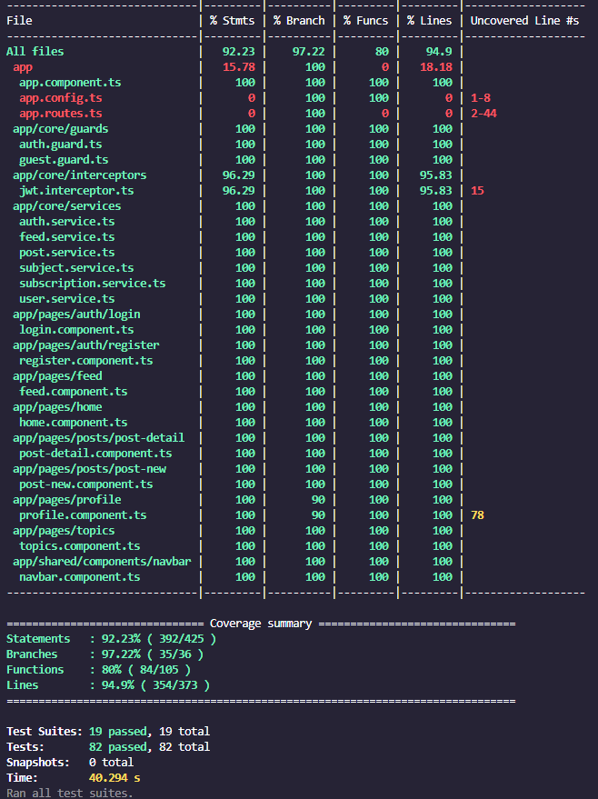
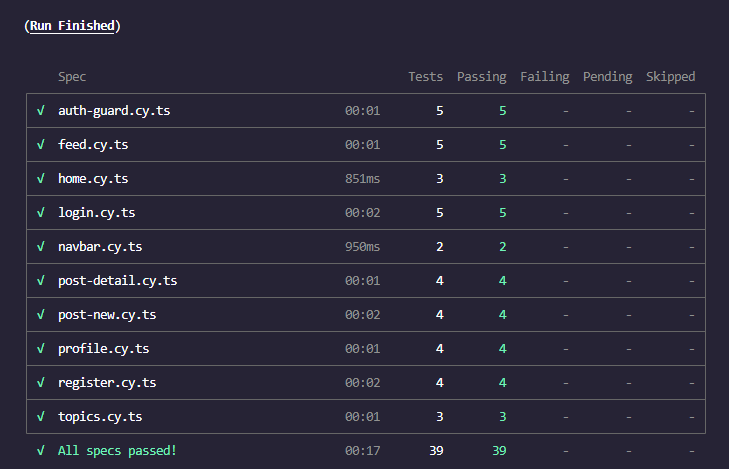
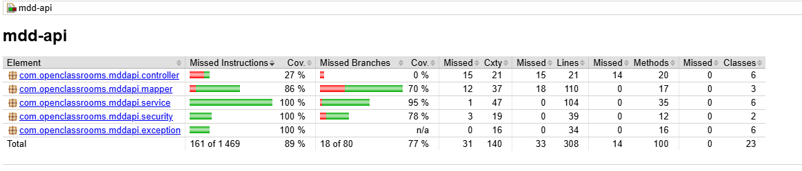

# MDD — Monde de Dév

Réseau social pour développeurs (projet P6 OpenClassrooms). L'application permet de s'inscrire, se connecter, s'abonner à des thèmes, consulter un fil d'actualité personnalisé, publier des articles et les commenter.

Le dépôt contient deux sous-projets :

- `back/` — API REST **Spring Boot 3.2.5 / Java 21** (Maven)
- `front/` — SPA **Angular 19** (standalone) + Angular Material

---

# 1 — README Technique

## Stack technique

| Couche          | Technologies                                                                                                                        |
| --------------- | ----------------------------------------------------------------------------------------------------------------------------------- |
| Back-end        | Java 21, Spring Boot 3.2.5 (Web, Security, Data JPA, Validation), JWT (jjwt 0.12.5), MapStruct, Lombok, springdoc-openapi (Swagger) |
| Base de données | PostgreSQL (runtime) · H2 (tests)                                                                                                   |
| Front-end       | Angular 19 (standalone), Angular Material 19, RxJS 7                                                                                |
| Tests           | JUnit 5 + Mockito + JaCoCo (back) · Jest + Cypress 13 (front)                                                                       |
| Build           | Maven (wrapper `mvnw`) · Angular CLI / npm                                                                                          |

## Architecture

### Back-end (`back/src/main/java/com/openclassrooms/mddapi`)

API en couches `controller → service → repository`. Les entités JPA ne sont jamais exposées : tout transite par des DTO mappés via **MapStruct**.

- `entity/` — `User`, `Subject`, `Post`, `Comment`
- `controller/` — `Auth`, `User`, `Post`, `Feed`, `Subject`, `Subscription`
- `service/` — logique métier
- `repository/` — Spring Data JPA
- `security/` — authentification **JWT** stateless (`JwtService`, `JwtAuthFilter`), `UserDetailsServiceImpl`
- `dto/request`, `dto/response` + `mapper/` — contrats d'API
- `exception/` — `GlobalExceptionHandler` (`@RestControllerAdvice`) + exceptions métier
- `config/` — `SecurityConfig`, `WebConfig` (CORS), `OpenApiConfig`

Toutes les routes sont préfixées par le context-path **`/api/v1`**. Documentation interactive disponible via **Swagger UI** (`/api/v1/swagger-ui.html`).

### Front-end (`front/src/app`)

Application Angular 19 **standalone** (sans NgModule), bootstrap via `app.config.ts`, routes dans `app.routes.ts`.

- Pages **lazy-loaded** (`loadComponent`), protégées par `authGuard` / `guestGuard`
- `core/services/` — appels HTTP (`Auth`, `User`, `Post`, `Feed`, `Subject`, `Subscription`)
- `core/interceptors/` — `jwtInterceptor` (ajoute le token Bearer)
- `core/models/` — interfaces typées
- `pages/` — `home`, `auth/login`, `auth/register`, `feed`, `posts/post-new`, `posts/post-detail`, `topics`, `profile`
- `shared/components/navbar`

## Principaux endpoints de l'API

Base : `http://localhost:8080/api/v1`

| Méthode | Route                        | Description                        | Auth |
| ------- | ---------------------------- | ---------------------------------- | :--: |
| POST    | `/auth/register`             | Inscription                        |  ✗   |
| POST    | `/auth/login`                | Connexion (username **ou** email)  |  ✗   |
| GET     | `/users/me`                  | Profil de l'utilisateur courant    |  ✓   |
| GET     | `/users/me/subscriptions`    | Thèmes suivis                      |  ✓   |
| GET     | `/users/{id}`                | Détail d'un utilisateur            |  ✓   |
| PUT     | `/users/{id}`                | Mise à jour du profil              |  ✓   |
| GET     | `/users/{id}/posts`          | Articles d'un utilisateur          |  ✓   |
| GET     | `/subjects`                  | Liste des thèmes                   |  ✓   |
| GET     | `/feed`                      | Fil d'actualité (tri par date)     |  ✓   |
| POST    | `/posts`                     | Créer un article                   |  ✓   |
| GET     | `/posts/{id}`                | Détail d'un article + commentaires |  ✓   |
| POST    | `/posts/{id}/comments`       | Ajouter un commentaire             |  ✓   |
| POST    | `/subscriptions/{subjectId}` | S'abonner à un thème               |  ✓   |
| DELETE  | `/subscriptions/{subjectId}` | Se désabonner d'un thème           |  ✓   |

> Les routes authentifiées exigent l'en-tête `Authorization: Bearer <token>`.

---

# 2 — README de Configuration

## Prérequis

- **Java 21** (JDK)
- **Node.js 18+** et **npm**
- **PostgreSQL** (pour exécuter le back-end ; non requis pour les tests)
- Maven n'a pas besoin d'être installé : utiliser le wrapper `./mvnw`

## Base de données

Créer une base PostgreSQL (par défaut nommée `mdd_db`) :

```sql
CREATE DATABASE mdd_db;
```

Le schéma est généré/mis à jour automatiquement au démarrage (`spring.jpa.hibernate.ddl-auto=update`).

## Configuration du back-end

La configuration se trouve dans `back/src/main/resources/application.properties` et est **surchargeable par variables d'environnement** :

| Variable             | Valeur par défaut | Description                                                |
| -------------------- | ----------------- | ---------------------------------------------------------- |
| `DB_HOST`            | `localhost`       | Hôte PostgreSQL                                            |
| `DB_PORT`            | `5432`            | Port PostgreSQL                                            |
| `DB_NAME`            | `mdd_db`          | Nom de la base                                             |
| `DB_USERNAME`        | `postgres`        | Utilisateur                                                |
| `DB_PASSWORD`        | `postgres`        | Mot de passe                                               |
| `app.jwt.secret`     | (clé par défaut)  | Secret de signature JWT — **à externaliser en production** |
| `app.jwt.expiration` | `86400000` (24h)  | Durée de validité du token (ms)                            |

Exemple (PowerShell) :

```powershell
$env:DB_PASSWORD = "monMotDePasse"
cd back
./mvnw spring-boot:run
```

L'API démarre sur **http://localhost:8080/api/v1**.

## Configuration du front-end

```bash
cd front
npm install        # une seule fois
npm start          # http://localhost:4200
```

L'URL de l'API consommée par le front est définie dans la configuration d'environnement Angular (`src/environments/`) — adapter si le back ne tourne pas sur `localhost:8080/api/v1`.

## Build de production

```bash
# Back
cd back && ./mvnw package          # produit le JAR dans target/

# Front
cd front && npm run build          # produit dist/
```

Un `Dockerfile` est fourni dans `back/` pour conteneuriser l'API (voir la section Docker ci-dessous).

## Lancement avec Docker

Le dépôt fournit un `docker-compose.yml` (racine) et un `Dockerfile` multi-stage (`back/`).

### Ce qui est conteneurisé

- **`postgres`** — base PostgreSQL 16, toujours démarrée. Données persistées dans le volume `postgres_data`, avec un *healthcheck* (`pg_isready`).
- **`app`** — l'API Spring Boot, démarrée **uniquement avec le profil `full`**. Elle se connecte à la base via le nom de service `postgres` (`DB_HOST=postgres`) et attend que le healthcheck Postgres soit au vert (`depends_on: service_healthy`) avant de démarrer.

> Le front Angular n'est pas conteneurisé : il se lance avec `npm start`.

### Le Dockerfile (`back/Dockerfile`)

Build **multi-stage** pour une image finale légère :

1. **Étape build** (image JDK 21) : télécharge les dépendances Maven (`dependency:go-offline`, mises en cache tant que `pom.xml` ne change pas), puis `./mvnw package -DskipTests` pour produire le `.jar`.
2. **Étape runtime** (image JRE 21) : copie uniquement le `.jar` depuis l'étape précédente et l'exécute (`java -jar app.jar`). Ni JDK, ni Maven, ni code source dans l'image finale.

### Modes de lancement

```bash
# Mode dev : seule la base tourne dans Docker ; le back se lance en local (./mvnw spring-boot:run)
docker compose up -d

# Mode complet : base + API conteneurisées (build de l'image via le Dockerfile)
docker compose --profile full up -d --build

# Arrêt
docker compose down        # ajouter -v pour supprimer aussi le volume (reset complet de la base)
```

- **Sans `--profile full`** → seul PostgreSQL démarre (workflow recommandé en développement : base dans Docker, back lancé depuis l'IDE pour le hot-reload).
- **Avec `--profile full`** → la base **et** l'API démarrent ensemble (l'API est disponible sur http://localhost:8080/api/v1).

---

# 3 — README — Exécution des tests

## Tests back-end (JUnit 5 + Mockito + JaCoCo)

Les tests s'exécutent sur une base **H2 en mémoire** : aucun PostgreSQL requis.

```bash
cd back
./mvnw test                          # tous les tests + rapport de couverture
./mvnw test -Dtest=AuthServiceTest   # une seule classe de test
```

- Rapport de couverture HTML : `back/target/site/jacoco/index.html`
- Le build **échoue si la couverture de lignes passe sous 70 %** (`jacoco:check`). Les packages `config`, `dto`, `entity` et la classe `MddApiApplication` sont exclus du calcul.
- Périmètre : services, sécurité JWT, mappers MapStruct, gestion d'erreurs, plus un test de chargement du contexte Spring (`MddApiApplicationTests`).

## Tests front-end unitaires / composants (Jest)

```bash
cd front
npm test                 # exécute tous les tests Jest
npm run test:watch       # mode watch
npm run test:coverage    # avec rapport de couverture
```

- Rapport de couverture HTML : `front/coverage/index.html`
- Seuil imposé : **70 %** (branches, fonctions, lignes, instructions)
- Périmètre : services, guards, intercepteur JWT, composants de page (HTTP simulé via `provideHttpClientTesting`).

## Tests end-to-end (Cypress 13)

Les scénarios e2e stubbent le back-end via `cy.intercept` + fixtures : **pas besoin d'API ni de base de données**, seul le serveur front est requis.

```bash
cd front
npm run cypress:open     # interface interactive (lance toi-même le serveur si besoin)
npm run e2e              # headless : démarre le serveur front puis lance Cypress
```

- Specs : `front/cypress/e2e/` (auth, feed, détail/création d'article, thèmes, navbar, profil, garde d'authentification).

## Récapitulatif des couvertures mesurées




